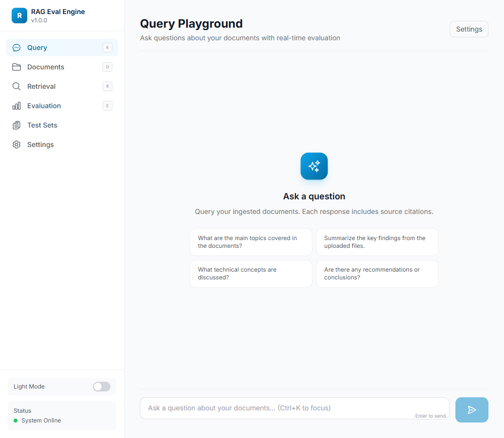
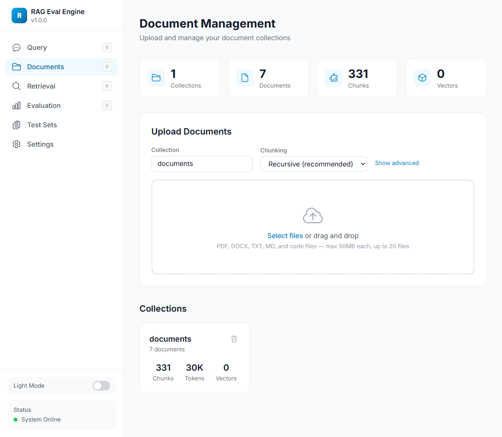
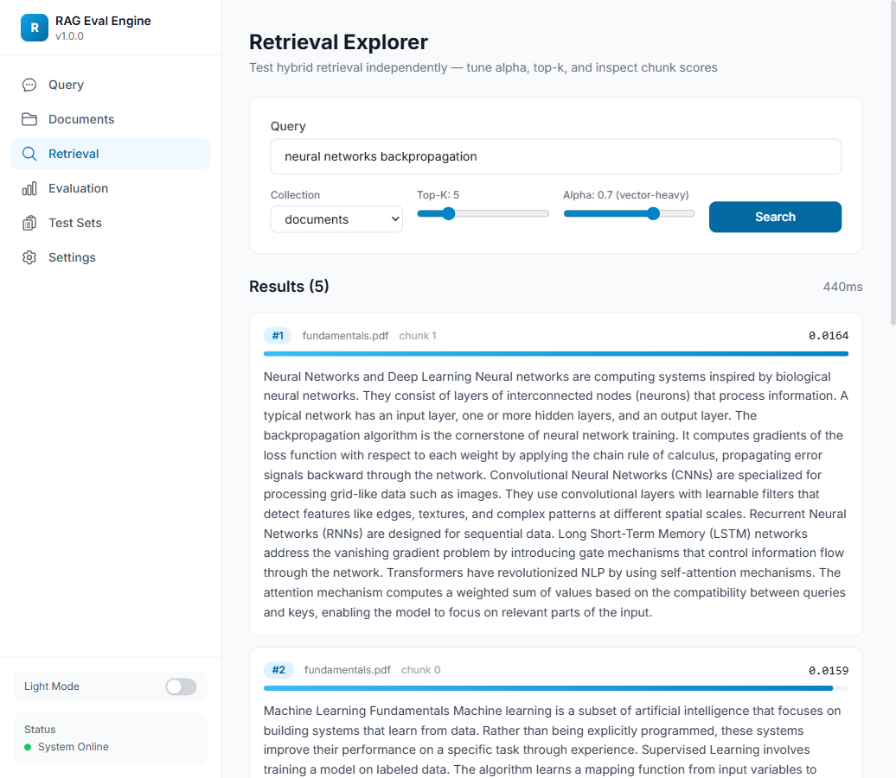
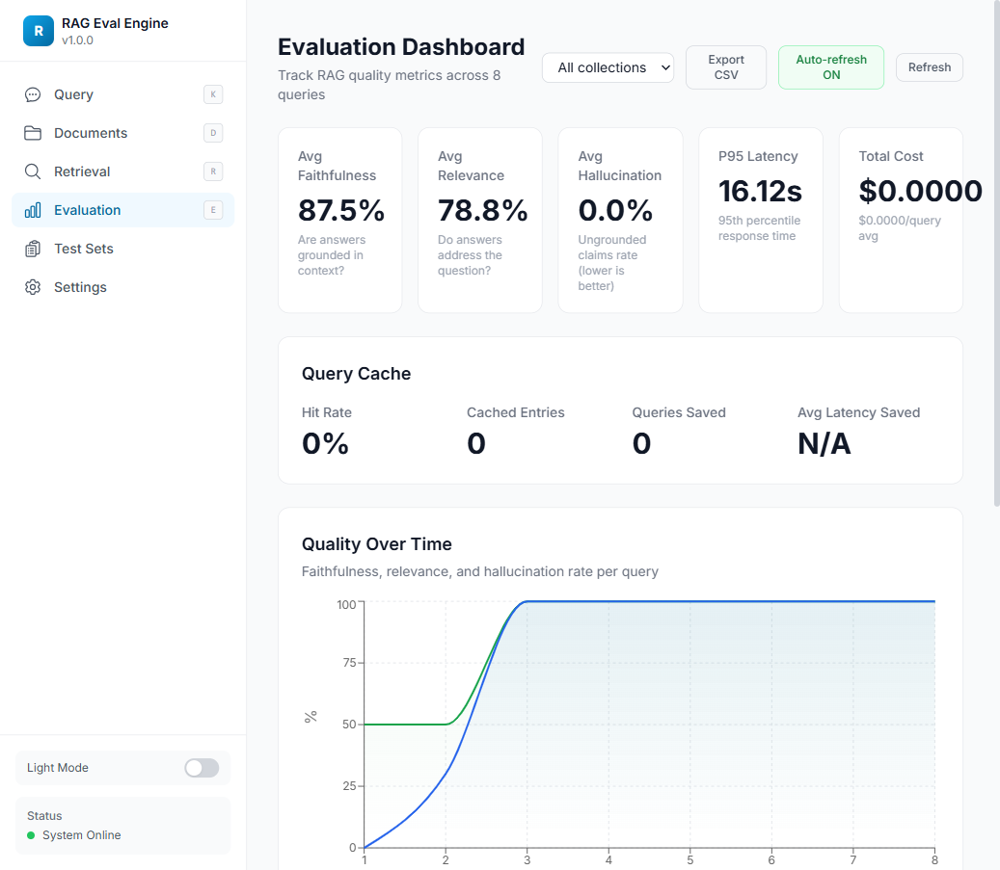
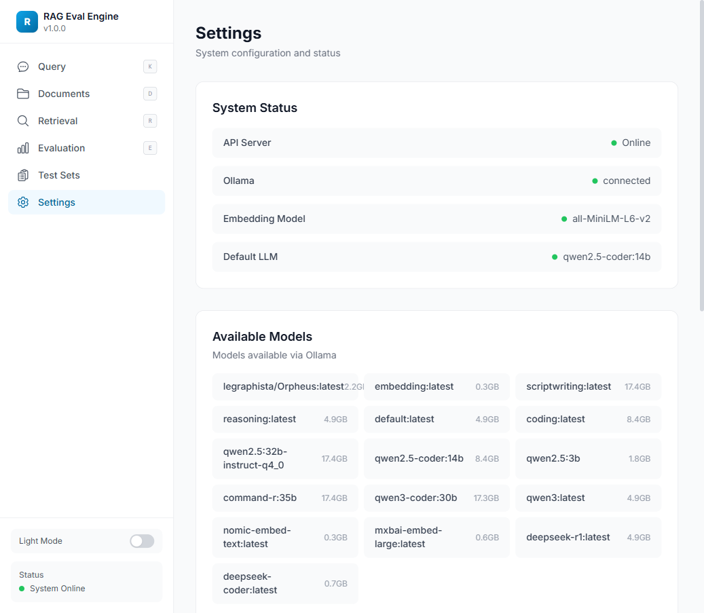

<p align="center">
  <h1 align="center">RAG Eval Engine</h1>
  <p align="center">
    Production-grade Retrieval-Augmented Generation with built-in evaluation harness
  </p>
</p>

<p align="center">
  <a href="#features"><strong>Features</strong></a> &middot;
  <a href="#quick-start"><strong>Quick Start</strong></a> &middot;
  <a href="#architecture"><strong>Architecture</strong></a> &middot;
  <a href="#dashboard"><strong>Dashboard</strong></a> &middot;
  <a href="#api-reference"><strong>API</strong></a> &middot;
  <a href="#configuration"><strong>Config</strong></a>
</p>

<p align="center">
  
  
  
  
  
  
  
  
</p>

---

## What is this?

RAG Eval Engine is a **complete RAG system** that doesn't just answer questions — it continuously **measures how well it answers them**. Every query runs through a full evaluation pipeline that scores faithfulness, relevance, and hallucination rate, giving you real-time visibility into your RAG quality.

**The problem:** Most RAG systems are black boxes. You stuff documents in, get answers out, and hope they're good.

**The solution:** Build evaluation into the pipeline itself. Every query gets scored. Every metric is tracked over time. You can see exactly when quality degrades and why.

---

## Features

### Hybrid Retrieval
- **Vector search** via Qdrant (cosine similarity)
- **Sparse search** via BM25 keyword matching
- **Reciprocal Rank Fusion** merges both with configurable alpha weighting
- Tune the balance between semantic understanding and keyword precision

### Document Ingestion
- Supports **PDF, DOCX, TXT, Markdown**, and 15+ code file types
- **3 chunking strategies**: fixed-size, recursive (default), semantic (sentence-boundary aware)
- Configurable chunk size and overlap with token-aware sizing
- Batch embedding with progress tracking

### LLM Generation
- **Ollama-first** (qwen2.5-coder, llama3, mistral, deepseek, etc.)
- OpenAI-compatible fallback
- **Streaming SSE** for real-time token output
- RAG-specific prompting with source citation instructions
- Context window management with token budgeting

### Evaluation (the differentiator)
| Metric | What it measures | Method |
|---|---|---|
| **Faithfulness** | Is the answer grounded in retrieved context? | LLM-as-judge |
| **Relevance** | Does the answer address the question? | LLM-as-judge |
| **Hallucination Rate** | What fraction of claims are ungrounded? | LLM-as-judge |
| **Context Precision** | Are retrieved chunks actually relevant? | Heuristic |
| **Context Recall** | Did we retrieve all necessary info? | LLM-as-judge (with ground truth) |

- **Inline eval** on every query (lightweight mode) or full batch eval on test datasets
- **Heuristic fallbacks** when LLM judge is unavailable
- All results stored in SQLite with timestamps for time-series analysis
- **Auto-generate** test questions from your documents

### Dashboard (6 pages)
| Page | Purpose |
|---|---|
| **Query Playground** | Chat interface with streaming, model selector, eval score badges, source citations |
| **Document Management** | Drag-and-drop upload, chunking strategy picker, file type badges, collection stats |
| **Retrieval Explorer** | Test hybrid retrieval independently, tune alpha/top-k, visualize chunk scores |
| **Evaluation Dashboard** | Time-series area charts, collection filter, auto-refresh, latency distribution |
| **Test Sets** | Create/manage test Q&A sets, auto-generate questions, run batch evaluations |
| **Settings** | System status, available models, full configuration display |

- **Dark mode** with system preference detection and manual toggle
- **Responsive** — works on mobile with collapsible sidebar
- **Real-time streaming** — watch tokens appear as the LLM generates

### Screenshots

| Query Playground | Document Management |
|---|---|
|  |  |

| Retrieval Explorer | Evaluation Dashboard |
|---|---|
|  |  |

| Test Sets | Settings |
|---|---|
|  |  |

---

## Architecture

```
┌─────────────────────────────────────────────────────┐
│                   Next.js Dashboard                  │
│  Query | Documents | Retrieval | Eval | Test Sets    │
└──────────────────────┬──────────────────────────────┘
                       │ REST API + SSE
┌──────────────────────▼──────────────────────────────┐
│                  FastAPI Gateway                      │
│  /ingest  /query  /retrieve  /evaluate  /metrics     │
└───┬──────────┬──────────┬──────────┬────────────────┘
    │          │          │          │
┌───▼───┐ ┌───▼───┐ ┌───▼────┐ ┌───▼─────┐
│Ingest │ │Hybrid │ │Generate│ │Evaluate │
│Pipeline│ │Ranker │ │Engine  │ │Engine   │
└───┬───┘ └───┬───┘ └───┬────┘ └───┬─────┘
    │    ┌────┴────┐    │          │
    ▼    ▼         ▼    ▼          ▼
┌────────┐┌──────┐┌──────┐┌──────┐┌────────┐
│Qdrant  ││Vector││BM25  ││Ollama││SQLite  │
│VectorDB││Search││Index ││/LLM  ││Metrics │
└────────┘└──────┘└──────┘└──────┘└────────┘
```

---

## Tech Stack

| Layer | Technology |
|---|---|
| **API** | FastAPI, Pydantic v2, Python 3.12+ |
| **Embeddings** | sentence-transformers (local), OpenAI (optional) |
| **Vector DB** | Qdrant |
| **Sparse Search** | BM25 via rank-bm25 |
| **LLM** | Ollama (primary), OpenAI (fallback) |
| **Documents** | PyMuPDF (PDF), python-docx (DOCX), plain text |
| **Evaluation** | LLM-as-judge metrics + heuristic fallbacks |
| **Database** | SQLite (WAL mode) for metrics |
| **Dashboard** | Next.js 14, Tailwind CSS, Recharts |
| **Type Safety** | TypeScript strict + Pyright strict |
| **Containers** | Docker Compose (Qdrant + API + Dashboard) |

---

## Quick Start

### Prerequisites

- Python 3.12+
- Node.js 20+
- [Ollama](https://ollama.com) running locally
- [Qdrant](https://qdrant.tech) running locally (or via Docker)

### 1. Start infrastructure

```bash
# Start Qdrant
docker run -d -p 6333:6333 -v qdrant_data:/qdrant/storage qdrant/qdrant

# Pull an LLM model
ollama pull qwen2.5-coder:14b
```

### 2. Start the API

```bash
cp .env.example .env  # edit as needed
pip install -e ".[dev]"
uvicorn src.main:app --reload --port 8000
```

### 3. Start the dashboard

```bash
cd dashboard
npm install
npm run dev
```

Open **http://localhost:3000**

### Docker Compose (full stack)

```bash
docker compose up -d
```

This starts Qdrant, the API, and the dashboard. Ollama must be running on the host.

---

## API Reference

| Method | Path | Description |
|---|---|---|
| `GET` | `/health` | System health check |
| `GET` | `/api/settings` | Current configuration |
| `GET` | `/api/models` | List available Ollama models |
| `POST` | `/api/ingest` | Upload and ingest files |
| `GET` | `/api/ingest/{job_id}` | Check ingestion job status |
| `GET` | `/api/collections` | List document collections |
| `DELETE` | `/api/collections/{name}` | Delete a collection |
| `POST` | `/api/retrieve` | Retrieve ranked chunks (hybrid search) |
| `POST` | `/api/query` | Full RAG pipeline (retrieve + generate + eval) |
| `GET` | `/api/metrics` | Aggregate eval metrics with time-series |
| `GET` | `/api/metrics/{query_id}` | Per-query eval breakdown |
| `POST` | `/api/test-sets` | Create a test Q&A set |
| `GET` | `/api/test-sets` | List test sets |
| `DELETE` | `/api/test-sets/{id}` | Delete a test set |
| `POST` | `/api/test-sets/auto-generate` | Auto-generate test questions from documents |
| `POST` | `/api/evaluate/batch` | Run batch evaluation on a test set |
| `GET` | `/api/evaluate/runs` | List evaluation runs |

---

## Configuration

All settings are configurable via environment variables (prefix `RAG_`) or `.env` file:

```bash
RAG_QDRANT_URL=http://localhost:6333      # Qdrant connection
RAG_EMBEDDING_MODEL=all-MiniLM-L6-v2      # or BAAI/bge-base-en-v1.5, text-embedding-3-small
RAG_CHUNKING_STRATEGY=recursive            # or fixed, semantic
RAG_CHUNK_SIZE=512                         # tokens per chunk
RAG_CHUNK_OVERLAP=50                       # overlap between chunks
RAG_OLLAMA_URL=http://localhost:11434      # Ollama connection
RAG_DEFAULT_MODEL=qwen2.5-coder:14b       # default LLM model
RAG_HYBRID_ALPHA=0.7                       # 0=pure BM25, 1=pure vector
RAG_DEFAULT_TOP_K=5                        # chunks to retrieve
RAG_EVAL_ON_QUERY=true                     # evaluate every query
RAG_EVAL_LIGHTWEIGHT=true                  # only faithfulness+relevance per query
```

---

## Project Structure

```
rag-eval-engine/
├── src/
│   ├── main.py                    # FastAPI entry point
│   ├── config.py                  # Pydantic settings
│   ├── ingestion/
│   │   ├── loader.py              # PDF, DOCX, text, code loading
│   │   ├── chunker.py             # 3 chunking strategies
│   │   └── embedder.py            # Local + OpenAI embeddings → Qdrant
│   ├── retrieval/
│   │   ├── vector_search.py       # Qdrant semantic search
│   │   ├── sparse_search.py       # BM25 keyword search
│   │   └── hybrid_ranker.py       # Reciprocal Rank Fusion
│   ├── generation/
│   │   ├── prompt_builder.py      # RAG prompt construction
│   │   └── llm_client.py          # Ollama + OpenAI, streaming
│   ├── evaluation/
│   │   ├── metrics.py             # Faithfulness, relevance, hallucination scoring
│   │   ├── eval_pipeline.py       # Query pipeline + batch eval
│   │   └── test_sets.py           # Test dataset management + auto-generation
│   ├── routes/
│   │   ├── ingest.py              # /api/ingest, /api/collections
│   │   ├── retrieve.py            # /api/retrieve
│   │   ├── query.py               # /api/query (+ SSE streaming)
│   │   └── evaluate.py            # /api/evaluate, /api/metrics, /api/test-sets
│   └── db/
│       └── models.py              # SQLite schema + async queries
├── dashboard/                     # Next.js 14 App Router
│   └── src/
│       ├── app/
│       │   ├── page.tsx           # Query Playground (streaming + eval)
│       │   ├── documents/         # Document upload & management
│       │   ├── retrieval/         # Retrieval Explorer
│       │   ├── eval/              # Evaluation dashboard with charts
│       │   ├── test-sets/         # Test set management & batch eval
│       │   └── settings/          # Configuration & status
│       ├── components/
│       │   └── sidebar.tsx        # Navigation + dark mode toggle
│       └── lib/
│           ├── api.ts             # Type-safe API client
│           └── utils.ts           # Formatting utilities
├── tests/                         # 68 tests
├── eval_datasets/                 # Sample Q&A pairs
├── docker-compose.yml             # Full stack orchestration
├── Dockerfile                     # Python API container
└── pyproject.toml                 # Project metadata & deps
```

---

## Testing

```bash
pip install -e ".[dev]"
pytest tests/ -v
```

**68 tests** covering:
- Chunking strategies (fixed, recursive, semantic) — 24 tests
- BM25 indexing and Reciprocal Rank Fusion — 15 tests
- Eval metric scoring and heuristics — 21 tests
- API endpoint integration — 8 tests

---

## Key Design Decisions

1. **Ollama-first**: Designed for local LLMs. No API keys needed to get started. OpenAI is an optional fallback.
2. **Hybrid retrieval**: Pure vector search misses keyword matches. Pure BM25 misses semantic meaning. RRF gives you both.
3. **Eval built-in**: Not a separate tool or pipeline. Every query optionally gets scored in-line.
4. **SQLite for metrics**: Zero-config, WAL mode for concurrent access. Metrics are a write-heavy append-only workload — perfect for SQLite.
5. **Heuristic fallbacks**: When the LLM judge is slow or unavailable, word-overlap heuristics provide approximate scores.

---

## License

MIT
